### mms/mms.cfg

#### MCU Configuration

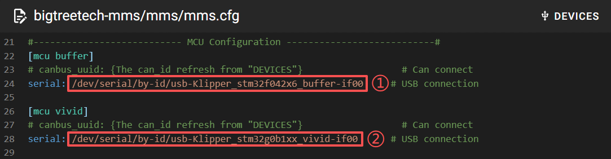

我们需要把设备实际的 serial id 填写到 `①: Buffer` 和 ` ②: ViViD` 位置，serial id 可使用以下两种方式获取

* 在 ssh 终端，通过命令查询, id 中有 `stm32f042x6_buffer`的是 `Buffer`, 有 `stm32g0b1xx_vivid`的是 ` ViViD`。

    ``` bash
    ls /dev/serial/by-id/*
    ```

    

* 在 mainsail 中

    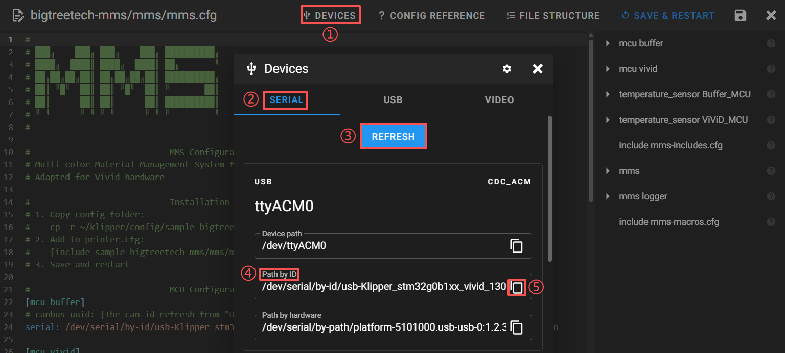

    * **① DEVICES**
    * **② SERIAL**: 查询 serial id 界面
    * **③ REFRESH**: 扫描 serial id
    * **④ Path by ID**: id 中带有 `stm32f042x6_buffer`的是 `Buffer`, 有 `stm32g0b1xx_vivid`的是 `ViViD`
    * **⑤**: 复制 id, 然后将复制的 id 粘贴到对应的配置中即可

#### MCU Temperature

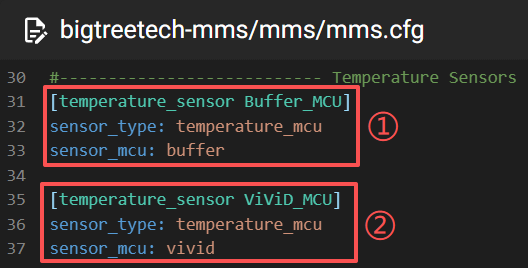

`①` 和 `②` 分别为 Buffer 和 ViViD 的 MCU 温度, 启用此配置后在 Mainsail (如下图所示) 和 KlipeprScreen 上都会显示对应的温度, 并且 klipper 也会将实时温度记录到 log 中, 可用于排查故障。所以请不要修改此配置, 除非你明确的知道它意味着什么。


#### Module Includes

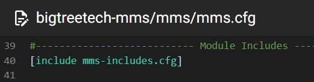

此配置包含并启动了 ViViD 所有子模块的功能, 请不要修改`此处`以及`mms-includes.cfg` 中的内容。

#### MMS Main Settings

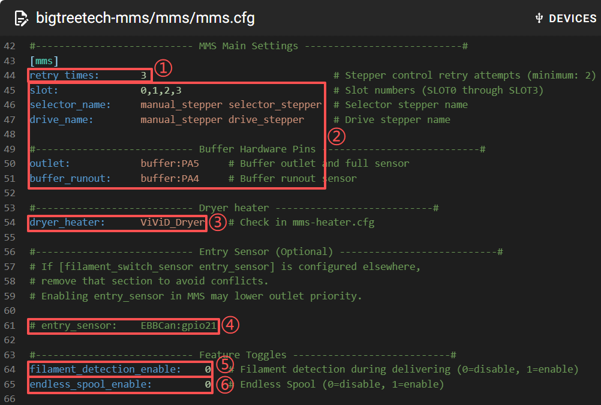

* ①: ViViD 任务失败后重试的次数。例如 `将耗材从Inlet加载到Gate中` 任务, 进料的长度超过设置的最大长度后Gate传感器仍然没有触发, 会认为此次任务执行失败并重试。重试超过 `retry_times` 次后如果仍然未恢复正常, 则会中止任务(如果打印机`正在打印`，ViViD也会发出`暂停打印`的指令)并抛出异常信息用于诊断, 排除故障后可继续任务。
* ②: ViViD 实际硬件映射关系的配置, 请不要修改这里。
* ③: ViViD 干燥加热器的名称。理应需要与`bigtreetech-mms/hardware/mms-heater.cfg`中配置的`heater_generic`名称一致，请不要修改它除非你明确知道它的作用。
* ④: Entry Sensor 一般安装在挤出机齿轮稍微上面的位置, 用于检测耗材是否到达了挤出机上方。

    强烈建议打印机安装此传感器并启用此配置。

    可以删除配置项最前面的 `#` 和 空格来启用此配置, 同时也需要将pin(图中的`EBBCan:gpio21`位置) 修改为传感器实际连接的pin。
* ⑤: 断料检测。实时监听 inlet 传感器的状态, 如果检测到当前所用的料槽没有耗材, 则会立即暂停打印。
* ⑥: 自动续料。当前`打印中`所用的料槽检测到断料后, 自动使用`mms-slot.cfg`文件中配置的`endless_with_slot`料槽续料。(`filament_detection_enable`断料检测必须启用才可使用此功能)

#### MMS Logger Configuration

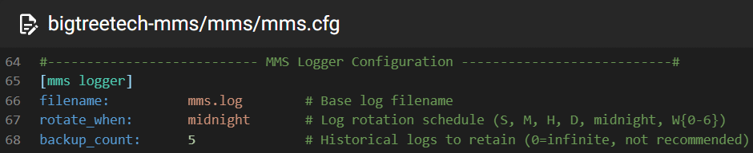

log 日志相关配置, 默认配置遵循 klipper 规范, 请不要修改此配置, 除非你明确的知道它意味着什么。

#### Macros Includes

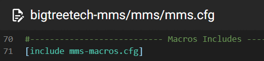

此配置包含了 ViViD 的宏命令配置。

#### MMS Slot Map (MMS_SLOT_MAP)

设置或显示每个料槽的耗材元数据（Moonraker lane data）。SLOT/SLOTS 是首选参数（为了兼容性也支持 GATE/GATES）。可选的温度字段包括 NOZZLE_TEMP 和 BED_TEMP。

**示例:**
```
MMS_SLOT_MAP
MMS_SLOT_MAP SLOT=0 MATERIAL='PETG' COLOR='FF0000' NAME='PETG HF Black Red' VENDOR='Bambu'
MMS_SLOT_MAP SLOTS=0,1,2,3 MATERIAL='PETG'
MMS_SLOT_MAP SLOT=0 NOZZLE_TEMP=240 BED_TEMP=80
MMS_SLOT_MAP RESET=1
```

#### RFID 相关命令

管理用于耗材识别的 RFID 标签。

*   **MMS_RFID_READ**: 读取指定料槽的 RFID 标签数据。
    *   `SLOT`: 料槽编号（例如 `SLOT=0`）。
    *   `SWITCH`: `1` 开始读取，`0` 停止。
*   **MMS_RFID_WRITE**: 向 RFID 标签写入元数据。
    *   `SLOT`: 料槽编号。
    *   `DATA`: 包含耗材元数据的 JSON 字符串。
    *   `ALIGN`: （默认：1）如果为 1，在写入前自动将标签与天线对齐。
*   **MMS_RFID_TRUNCATE**: 清除料槽的缓存 RFID 数据。
    *   `SLOT`: 料槽编号。
*   **MMS_RFID_RESET**: 重置 RFID 读取器和内部状态。

**MMS_RFID_WRITE 示例:**
```
MMS_RFID_WRITE SLOT=0 DATA='{"brand_name": "BTT", "material_type": "PLA", "primary_color": "FF0000"}'
```
所有支持的字段请参考 `config/bigtreetech-mms/rfid/rfid_write.json`。

### base/mms-cut.cfg

#### [mms cut]

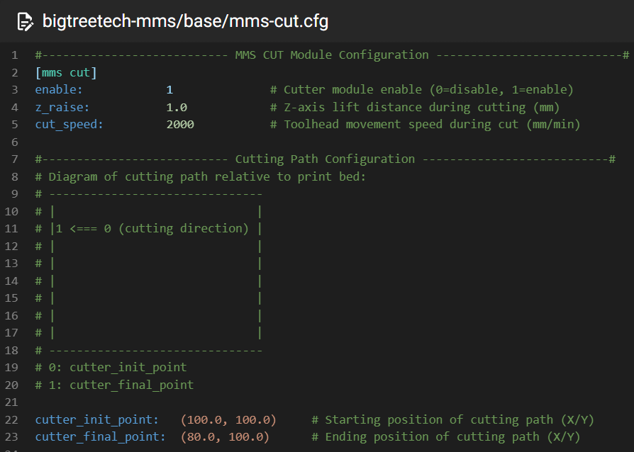

移动 toolhead 撞击固定位置来触发切刀切料。

* **enable**: 启用或禁用此模块
* **z_raise**: 执行 MMS_CUT 动作前, z 轴抬升的高度, 命令执行完成后 z 轴高度会恢复原始高度。

    此参数仅作用于手动执行 MMS_CUT 命令。
    
    换料流程中的 cut 动作不会额外应用此参数抬升 z 轴，而是由`[mms swap]`中的参数统一抬升 z 轴
* **cutter_init_point**: 预备切料时 toolhead 需要处于的位置, 请修改为打印机实际的坐标位置。
* **cutter_final_point**: 耗材已被切断时 toolhead 需要处于的位置, 请修改为打印机实际的坐标位置。
* **cut_speed**: toolhead 由 `cutter_init_point` 到 `cutter_final_point` 之间的移动速度。


### base/mms-motion.cfg

#### [mms delivery]

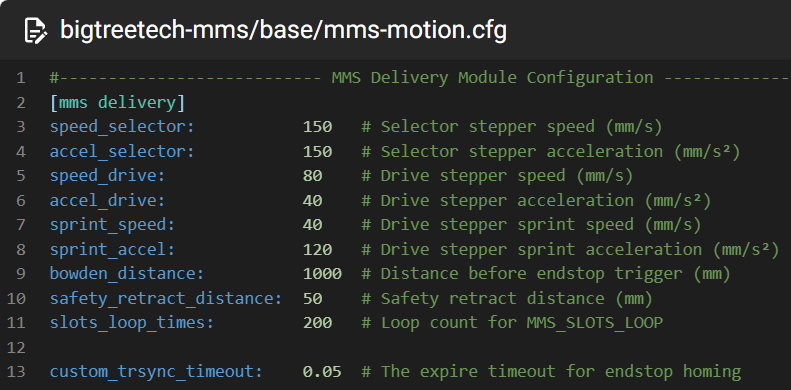

* **speed_selector**: 选料电机运动的速度, `mms-stepper.cfg` 中的传动距离为 `360/2.5`=144mm/转, 所以默认的 150mm/s ≈ 1.04 转/秒
* **accel_selector**: 选料电机运动的加速度
* **speed_drive**: 送料电机运动的速度, `mms-stepper.cfg` 中的传动距离为 `360/43`≈ 8.37mm/转, 所以默认的 80mm/s ≈ 9.56 转/秒
* **accel_drive**: 送料电机运动的加速度
* **sprint_speed**: 短距离移动速度
* **sprint_accel**: 短距离移动加速度
* **bowden_distance**: 耗材在 `Inlet` 到 `Buffer`, 或者 `Buffer` 到 `Extruder` 之间进退料时, 单次移动的最大长度。如果超出此长度后对应的传感器仍然没有触发, 则判定此次进退料异常。
* **safety_retract_distance**: 耗材由 `Extruder` 退到 `Buffer` 时, `Gate` 传感器释放后, 再多退出 `safety_retract_distance` 长度的耗材, 使耗材远离 `Gate` 传感器, 从而避免 `Gate` 传感器处于`触发`/`释放`的临界状态导致的误报。
* **slots_loop_times**: 执行 `MMS_SLOTS_LOOP` 自检命令时, 所有料槽自检的次数。4个料槽各进退料1次代表自检1次。
* **custom_trsync_timeout**: 此配置会覆盖`klippy/mcu.py`中的`TRSYNC_TIMEOUT`值，如果您遇到了`Communication timeout during homing`相关的问题，可以适当的增加此值。

#### [mms autoload]

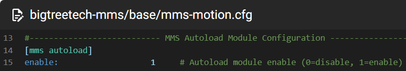

耗材插入 `Inlet` 触发传感器后, 自动将此料槽耗材加载到 `Buffer` 中。

enable 默认开启。仅在 ViViD 空闲时会自动进料。当 ViViD 正在进/退其他料槽的耗材或者正在打印时自动进料功能不会生效。

#### [mms charge]

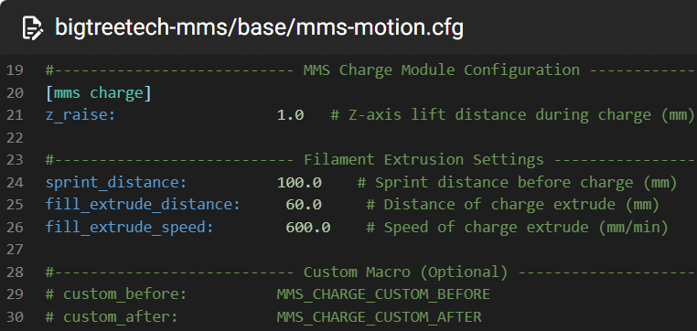

ViViD 将耗材加载到 Extruder, Buffer 的 Outlet 传感器被触发, 此时耗材理应已处于 Extruder 的正上方, Extruder 挤出一小段距离(`extrude_distance`)尝试咬住耗材。

如果 Outlet 传感器被释放则证明 Extruder 已顺利咬住耗材, charge 完成。
如果 Outlet 未释放则重新挤出 `extrude_distance`, 最多尝试 `extrude_times` 次, 如果仍未释放则判定此次 charge 失败。

本模块用于保证耗材成功进入 Extruder。

* **z_raise**: 执行 MMS_CHARGE 动作前, z 轴抬升的高度, 命令执行完成后 z 轴高度会恢复原始高度。

    此参数仅作用于手动执行 MMS_CHARGE 命令。
    
    换料流程中的 charge 动作不会额外应用此参数抬升 z 轴，而是由`[mms swap]`中的参数统一抬升 z 轴
* **sprint_distance**: 加载耗材到挤出机时，entry/outlet传感器触发后，ViViD慢速退料/进料的距离。额外的缓慢进料可以提高挤出机咬住耗材的几率。
* **fill_extrude_distance**: ViViD与挤出机同步进料的距离
* **fill_extrude_speed**: ViViD与挤出机同步进料的速度
* **custom_before**: charge 之前执行的 gcode 命令, 用于自定义动作
* **custom_after**: charge 完成后执行的 gcode 命令, 用于自定义动作

#### [mms eject]

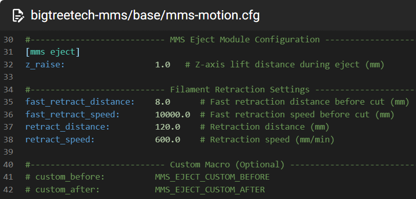

本模块用于保证耗材成功退出 Extruder。

* **z_raise**: 执行 MMS_EJECT 动作前, z 轴抬升的高度, 命令执行完成后 z 轴高度会恢复原始高度。

    此参数仅作用于手动执行 MMS_EJECT 命令。
    
    换料流程中的 eject 动作不会额外应用此参数抬升 z 轴，而是由`[mms swap]`中的参数统一抬升 z 轴
* **fast_retract_distance**: 切料前快速回抽耗材的距离，快速回抽一段距离避免喷嘴漏料
* **fast_retract_speed**: 切料前快速回抽耗材的速度
* **retract_distance**: 切刀切断耗材后，ViViD与挤出机同步退料的距离
* **retract_speed**: 切刀切断耗材后，ViViD与挤出机同步退料的速度
* **custom_before**: eject 之前执行的 gcode 命令, 用于自定义动作
* **custom_after**: eject 完成后执行的 gcode 命令, 用于自定义动作

#### [mms swap]

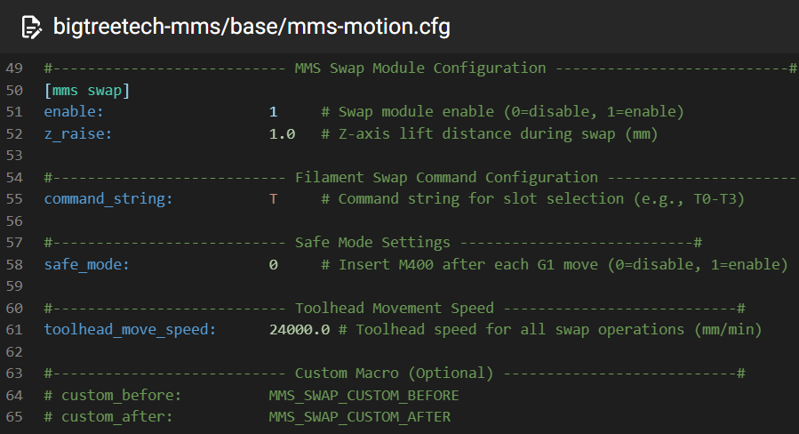

* **enable**: 此配置不会禁用 `custom_before` 和 `custom_after` 命令, 所以我们可以通过此配置禁用默认的 swap 换料流程, 使用脚本实施自定义的`换料`流程。
* **z_raise**: 换料前, z 轴抬升的高度, 换料完成后 z 轴高度会恢复原始高度。

* **skip_same_slot**: 启用时（默认），如果请求的料槽（映射后）已经是当前加载的料槽，系统将跳过换料流程。这可以避免冗余的冲刷和清理。

* **command_string**: 换料 gcode 命令的名称, 默认的 `T` 意味着 gcode 命令为 `T0`,`T1`,`T2`,`T3`... 。请不要修改此配置, 除非你明确的知道它意味着什么。
* safe_mode: 每个 G1 移动命令后都添加 M400 逻辑, 用于等待当前移动命令执行完成后再进行一下步动作。请不要修改此配置, 除非你明确的知道它意味着什么。
* **toolhead_move_speed**: toolhead 的移动速度
* **custom_before**: swap 之前执行的 gcode 命令, 用于自定义动作
* **custom_after**: swap 完成后执行的 gcode 命令, 用于自定义动作


### base/mms-purge.cfg

#### [mms purge]

新的耗材加载到 Extruder 后, Extruder切刀下方以及Nozzle的腔体内还残留有旧的耗材, 我们需要此流程将旧耗材冲刷出Nozzle。

可以适当多挤出一些避免残留的旧耗材与新耗材混色。

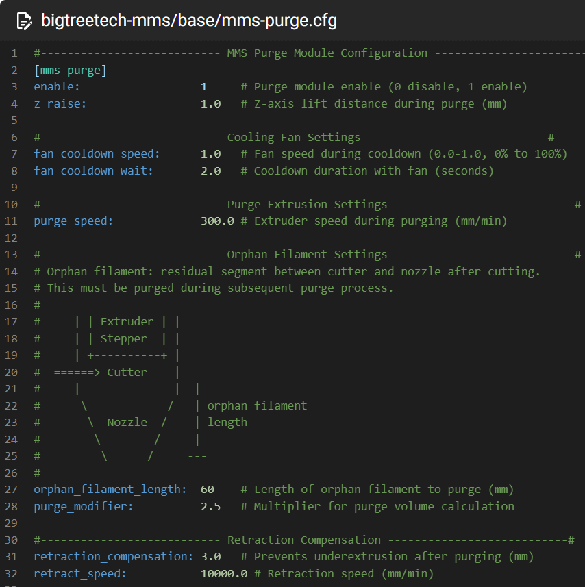

* **enable**: 仅会禁用 `orphan_filament_length` 和 `purge_modifier` 设置的冲刷距离。
* **z_raise**: 执行 PURGE, MMS_PURGE, MMS_TRAY 或 MMS_TRAY_EJECT 动作前, z 轴抬升的高度, 命令执行完成后 z 轴高度会恢复原始高度。

    此参数仅作用于手动执行 MMS_EJECT 命令。
    
    换料流程中的 purge 动作不会额外应用此参数抬升 z 轴，而是由`[mms swap]`中的参数统一抬升 z 轴
* fan

    必需要配置 [[fan]](https://www.klipper3d.org/Config_Reference.html#fan)

    * **fan_cooldown_speed**: 冲刷完旧耗材后开启风扇的转速, 用于冷却喷嘴上残留的耗材, 便于后续使用brush刷子清理喷嘴。
    * **fan_cooldown_wait**: 风扇开启后等待`fan_cooldown_wait`秒来冷却耗材。

* purge
    * **purge_speed**: Exturder 冲刷旧耗材的挤出速度。
    * **orphan_filament_length**: 旧耗材剩余的长度。
    * **purge_modifier**: 旧耗材的冲刷倍率。

        Exturder实际冲刷的长度为 `orphan_filament_length * purge_modifier` 也就是默认冲刷 `60 *2.5 = 150mm`。
        
        `purge_modifier` 的设计初衷是: 虽然从切刀到Nozzle中剩余的旧耗材长度一样, 但是深颜色(dark)理应比浅颜色(bright)所需要的冲刷量更多一些, 因为深颜色更容易混色。所以理论上我们只需要设置统一的 `orphan_filament_length` , 然后通过旧耗材的颜色动态计算合适的 `purge_modifier` 冲刷倍率, 就可以在保证不混色的前提下尽可能的减少耗材冲刷从而减少浪费。但是现在这里还是固定值, 我们现在不需要修改此处。只需理解它的含义并设置合适的 `orphan_filament_length` 即可。

* Retraction
    * **retraction_compensation**: 冲刷完旧耗材后快速回抽一小段距离, 尽可能减少已融化的耗材从Nozzle流出。此参数需要与切片软件中的`换料前回抽`参数一致或者略多一些。例如 OrcaSlicer 中的配置在如下图中的位置 `Printer settings-> Extruder -> Retraction when switching material -> length`。

        

    * **retract_speed**: 快速回抽的速度

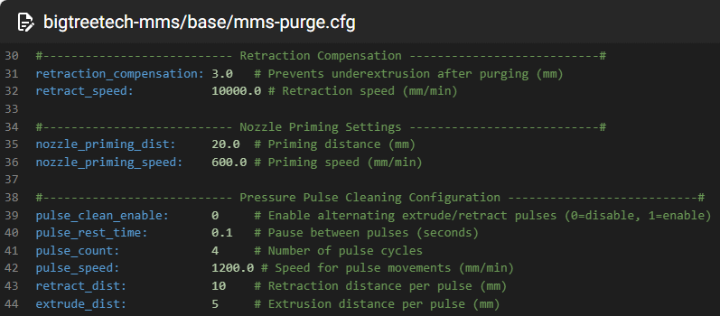

* **axis_first**:
    * `X`: 先移动 X 轴, 再移动 Y 轴
    * `Y`: 先移动 Y 轴, 再移动 X 轴
    * `XY`: X、Y 轴同时移动
* **tray_point**: purge 时 toolhead 停靠的坐标位置。
* **eject_point**: 部分机型的垃圾桶采用移动 toolhead 压缩弹性机构然后释放, 将冲刷出的旧耗材弹射出去。此参数用于配置弹射耗材时 toolhead 需要移动的终点坐标
* **custom_before**: purge 之前执行的 gcode 命令, 用于自定义动作
* **custom_after**: purge 完成后执行的 gcode 命令, 用于自定义动作

#### [mms brush]

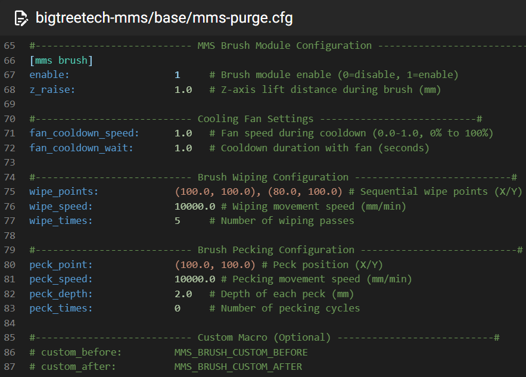

移动 toolhead 将喷嘴移动到固定位置(brush刷子所在的位置), 在刷子上来回移动清理喷嘴。

* **enable**: 此配置不会禁用 `custom_before` 和 `custom_after` 命令, 所以我们可以通过此配置禁用默认的 brush 流程, 使用脚本实施自定义的`清理喷嘴`流程。
* **z_raise**: 执行 BRUSH, MMS_BRUSH, MMS_BRUSH_WIPE, 或 MMS_BRUSH_PECK 动作前, z 轴抬升的高度, 命令执行完成后 z 轴高度会恢复原始高度。

    此参数仅作用于手动执行 MMS_EJECT 命令。
    
    换料流程中的 brush 动作不会额外应用此参数抬升 z 轴，而是由`[mms swap]`中的参数统一抬升 z 轴
* fan

    必需要配置 [[fan]](https://www.klipper3d.org/Config_Reference.html#fan)

    * **fan_cooldown_speed**: 刷喷嘴前开启风扇的转速, 用于冷却喷嘴上残留的耗材, 便于后续使用brush刷子清理喷嘴。
    * **fan_cooldown_wait**: 风扇开启后等待`fan_cooldown_wait`秒来冷却耗材。
* wipe 刷喷嘴
    * **wipe_points**: 清理喷嘴时 toolhead 移动的坐标值 (brush刷子所在的坐标)
    * **wipe_speed**: 清理喷嘴时 toolhead 移动的速度
    * **wipe_times**: 清理喷嘴时 toolhead 在 wipe_points 之间来回移动的次数
* peck 将喷嘴在brush刷子上敲击几下进一步清理喷嘴。由于brush刷子需要与 toolhead 在z轴上一起抬升/下降, 所以此功能作用不明显, 推荐不启用。
    * **peck_point**: brush刷子正中心的坐标, 喷嘴停靠于此坐标, z轴上下移动进一步清理。
    * **peck_speed**: z轴上下移动的速度
    * **peck_depth**: z轴上下移动的高度
    * **peck_times**: z轴上下移动的次数
* **custom_before**: brush 之前执行的 gcode 命令, 用于自定义动作
* **custom_after**: brush 完成后执行的 gcode 命令, 用于自定义动作


### hardware/mms-slot.cfg

#### [mms slot xxx]

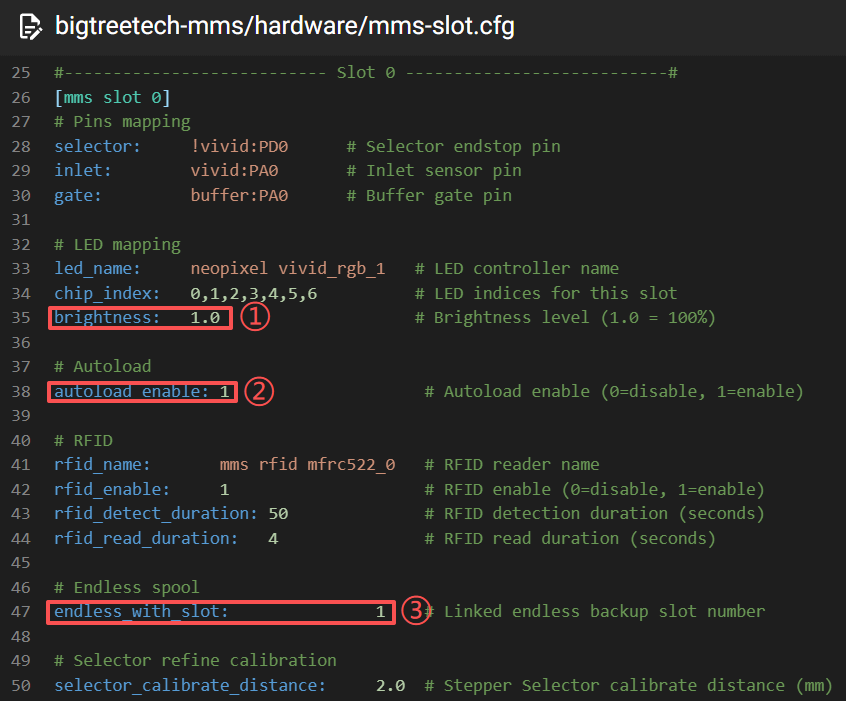

* **① brightness**: 可配置 RGB 的亮度, 1.0 代表 100% 亮度
* **② autoload_enable**: 在 `base/mms-motion.cfg` 中使能 `[mms autoload]` 后, 对应的 slot 可以通过此单独"启用/禁用"自动进料。
* **③ endless_with_slot**: 在 `mms/mms.cfg` 中使能 `endless_spool_enable` 后, 对应的 slot 需要设置此配置, `打印时`检测到此料槽耗材用尽(Inlet未触发)后, 会使用此配置中的料槽自动续料。

    例如图中的 slot0 的 endless_with_slot 设置为 1。那么`打印时` slot0 料槽的耗材用尽后会自动加载 slot1 的耗材继续打印。
